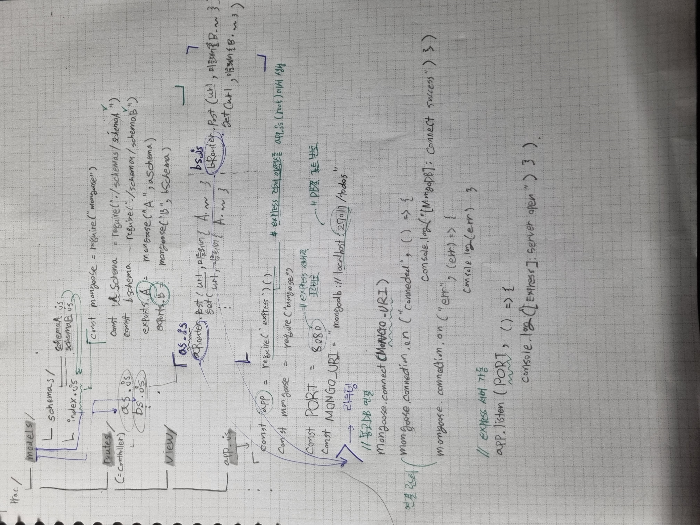

# practice web ( 2022.07.21 )
AI 양재허브 3주차 강의 실습을 복습 및 참고하며, Express와 Mongoose를 이용해 MVC 패턴을 적용한 간단한 나만의 웹서비스를 만들고 연습해봅니다.

  

## 주제 : TODO

## 핵심 목표
1. MongoDB 연동
2. MVC 패턴 설계
3. CRUD 기능 구현
4. 로그인, 회원가입, JWT 인증
5. Pagination

  

## 사용 기술

1. express.js
2. MongoDB (+ Mongoose )
3. nodemon

  

---

 

## 1차 설계 

